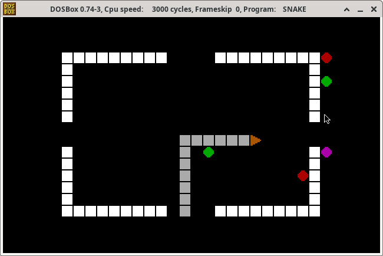

Snake for DOS
=============

This is a snake game for DOS. It will run under DOSBox and QEMU with
FreeDOS (and probably other environments which are x86 and DOS
compatible). The game has 10 different levels.



Instructions:
-------------
- Move snake with direction keys or WASD
- Eat green and purple food (purple food grows the snake faster)
- Avoid eating red food
- Avoid hitting yourself and walls

Keys:
-----
- **Up**, **Left**, **Right**, **Down**: Movement
- **W**, **A**, **S**, **D**: Movement
- **1**-**9**, **0**: Select level
- **P**: Pause
- **R**: Restart
- **ESC**, **Q**: Quit

Building:
---------
Building requires make, gcc and python. mtools is required for building
a DOS disk image.

```
make snake.com
```

Running:
--------
```
dosbox snake.com
```
